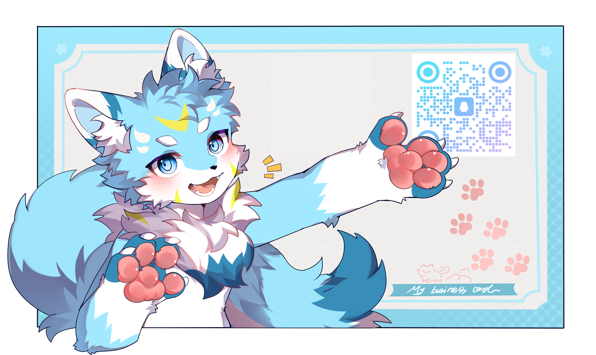

<!-- 
  👋 Hi! I'm Moche — a blue wolf who codes, crypts, and dreams.
-->

<h1 align="center">Hello! I'm Moche!</h1>

  

---

### 🐾 About Me

- **Fursona**: A blue wolf 🐺💙  
- **Education**: Incoming Master’s Student 🎓  
- **Hobbies**: Singing 🎤 | Digital & Traditional Art 🎨  
- **Languages**: Chinese 🇨🇳 | English 🇬🇧  
- **Coding in**: Python 🐍 | C++ ⚡  
- **Passionate about**: Algorithm Design & Analysis | Cryptography 🔐 | Mathematics ∞  

### 💭 About My Dreams

> To design my own cryptographic algorithm **or** discover a novel cryptanalytic method —  
> and to share a sweet, mutual, head-over-heels kind of love. ❤️

  <!-- Replace this with your actual card/avatar image when ready -->
  
   <em>My personal card will go here!</em>

---

### 📦 About This Repo

This is my sandbox for learning:  
small algorithms, crypto experiments, code snippets, and side projects I’m tinkering with.  

✨ **Feel free to explore, comment, or open an issue!**  
Your feedback means a lot — let’s learn together.

